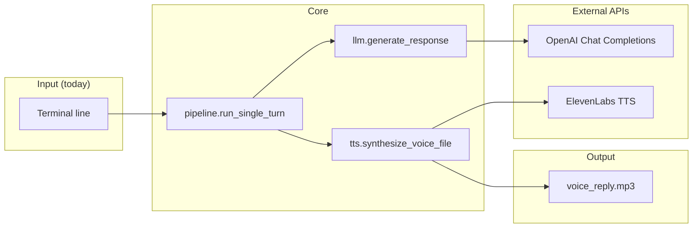

# AI Voice Customer Agent (Demo)

This project is a **prototype** of a voice-based AI agent designed to simulate **real customer interactions**—not a toy “text-to-speech” script, but a minimal **agent loop** you can show to stakeholders when scoping voice support, concierge flows, or API-led demos.

**Pipeline:** *User input → Response generation → Voice output*

In this build, “user input” is **typed in the terminal** (standing in for speech-to-text); **response generation** uses an LLM; **voice output** is produced with **ElevenLabs** and saved as **`voice_reply.mp3`** at the **project root** (stable path regardless of shell `cwd`). That keeps the story honest while still mapping cleanly to production architectures (STT → policy/LLM → TTS).

---

## Repository layout

```text
voice-agent-demo/
├── voice_agent/          # importable package (interview-friendly structure)
│   ├── __init__.py       # version
│   ├── __main__.py       # python -m voice_agent
│   ├── settings.py       # env, constants, .env loading
│   ├── llm.py            # OpenAI — response step
│   ├── tts.py            # ElevenLabs — voice step
│   ├── pipeline.py       # input → response → voice orchestration
│   └── cli.py            # sys.exit / stderr handling
├── tests/                # pytest; external APIs mocked
├── main.py               # thin shim → voice_agent.cli (backward compatible)
├── pyproject.toml        # pytest + ruff configuration
├── requirements.txt
├── .env.example
└── LICENSE
```

---

## Architecture



**Design choices useful in a technical interview**

| Choice | Rationale |
|--------|-----------|
| Package + thin `main.py` | Keeps **installable / testable** boundaries; CLI is not the whole program. |
| `settings.py` | Single place for **env + constants**; avoids scattered `os.environ`. |
| Injectable `OpenAI` client in `generate_response` | **Testability** without hitting the network. |
| `read_input` / `output_path` hooks on `run_single_turn` | Same pipeline testable in **CI** with mocks. |
| Absolute `DEFAULT_OUTPUT` under project root | Predictable artifact path when demos run from different directories. |

---

## What problem this prototypes

Organizations want **self-serve voice** that still feels **guided and on-brand**—not a dumb IVR readout of static scripts. This demo shows a **minimal pipeline** from **customer utterance → model-generated answer → voiced response**, suitable for workshops with stakeholders or as a **technical spike** ahead of a pilot.

**Today’s scope (intentional):** one turn, text “utterance” in the terminal, single MP3 artifact. **Out of scope:** speech-to-text, telephony, ticketing, or multi-turn memory—those are the natural next layers on the same backbone.

---

## How it maps to a real product conversation

| Stage | In this prototype | Production analogue |
|--------|-------------------|----------------------|
| Customer speaks | Typed line after `User:` | STT / telephony / chat widget |
| Agent reasons | OpenAI Chat Completions (`gpt-4o-mini` by default) | Policy-grounded LLM + tools |
| Agent responds in voice | ElevenLabs Text-to-Speech → `voice_reply.mp3` | Streaming TTS, phone playback, kiosk |

The **system prompt** biases answers toward **short, clear phrasing** suited for **listening**, which is how you’d tune an assistant before wiring CRM or knowledge-base tools.

---

## Real-world use cases (customer support & automation)

This prototype mirrors how **contact centers** and **digital product** teams experiment with **voice + LLM** before committing to full CCaaS or custom stacks.

### Customer support

- **Tier‑1 deflection** — Answer FAQs (“Where is my order?”, “How do I reset my password?”) with **consistent, speakable** wording, freeing agents for exceptions and escalations.
- **After-hours coverage** — Same intents as business hours, without promising human availability; voice can feel more **reassuring** than a static FAQ page when the customer is stressed or on the move.
- **Guided troubleshooting** — Step-by-step flows (network issues, device setup) where the model **adapts** to what the customer said, while product still controls **tone and length** via prompts and, later, retrieval over approved articles.
- **Warm handoff** — Even in this demo the pattern is *understand → reply → speak*; in production that middle step becomes **summarize for the agent** + ticket payload so humans pick up with context.

### Automation & operations

- **Status and notifications** — Turn structured events (order shipped, appointment confirmed) into **natural spoken** updates for IVR, outbound dialers, or kiosk apps—same APIs, different triggers than “user typed a question.”
- **Back-office + customer-facing alignment** — The same **LLM + TTS** stack can prototype **internal** “read me this summary” tools and **external** voice experiences, so automation teams validate integrations once.
- **Workflow hooks** — Pair this pipeline with queues, webhooks, or CRM updates: voice becomes the **presentation layer** while automation handles **state** (case ID, SLA, language).

### Other contexts (same backbone)

- **Voice concierge** — Hotels, banking, retail: spoken confirmation and next steps.
- **Sales / customer success** — Personalized follow-ups driven by the user’s wording.
- **Presales & demos** — Repeatable **API-first** story for stakeholders without a full telephony build on day one.

---

## Technical overview

- **Runtime:** Python 3.9+ (`requirements.txt`; `pyproject.toml` holds **pytest/ruff** tool config).
- **Orchestration:** `voice_agent.pipeline.run_single_turn` — **input → response → voice**; `voice_agent.cli` handles process exit codes.
- **Configuration:** API keys via **environment** or **`.env`** at project root (never committed); see `.env.example`.
- **Output:** `voice_reply.mp3` at **project root** after a successful run.

**APIs in play**

- **OpenAI** — Chat Completions for the assistant reply (model override: `OPENAI_MODEL`).
- **ElevenLabs** — `v1/text-to-speech` with configurable `voice_settings` (stability / similarity in `settings.py`).

---

## Development & testing

```bash
pip install -r requirements.txt
python -m pytest          # 4 tests; no real API calls
```

Tests **mock** OpenAI and ElevenLabs boundaries so CI / laptop runs stay **fast and deterministic**. Extend with integration tests (flagged) if you need to validate live API contracts.

---

## Quick start

```bash
python3 -m venv .venv
source .venv/bin/activate   # Windows: .venv\Scripts\activate
pip install -r requirements.txt
cp .env.example .env        # then set keys in .env
python main.py              # or: python -m voice_agent
```

Required variables: `OPENAI_API_KEY`, `ELEVENLABS_API_KEY`. Optional: `OPENAI_MODEL`.

---

## Talking points (technical interview)

- **Why a package?** Separation of **I/O** (`cli`), **orchestration** (`pipeline`), and **vendor clients** (`llm`, `tts`) mirrors how you’d split a service later (e.g. FastAPI router → domain service → adapters).
- **How would you add STT?** Replace `read_input` with a speech module that returns text; keep `generate_response` / TTS unchanged.
- **How would you scale?** Async clients, streaming TTS, session store, observability (traces/metrics), and retrieval + tools between LLM and customer—not a bigger `main.py`.

---

## Next steps (toward a real product)

Ideas to evolve this spike into something **shippable**, roughly in dependency order:

1. **Speech in (STT)** — Add Whisper or a vendor speech API so the loop is **voice-in / voice-out**, not terminal typing.
2. **Streaming** — Stream LLM tokens and **stream TTS** to cut perceived latency; required for tolerable phone and web voice UX.
3. **Memory & sessions** — Multi-turn history, session IDs, and **summarized context** for long calls; optional reset per customer or per case.
4. **Tools & data** — Grounding with **retrieval** over help center / policies; function calls to **ticketing, order lookup, scheduling** instead of free-form only.
5. **Human handoff** — Queue integration (Zendesk, Salesforce, Genesys, etc.) with **transcript + intent + suggested reply** for the agent.
6. **Channels** — WebRTC or **SIP / telephony** trunks, WhatsApp voice notes, or embedded widgets—not only a local MP3 file.
7. **Safety & compliance** — PII redaction, **audit logs**, content filters, regional data residency, and explicit **disclaimers** when the model is uncertain.
8. **Observability** — Traces, latency metrics, cost per turn, and A/B prompts so support and automation teams can **operate** the agent, not only demo it.

---

*Built as a **prototype**, not production software—intended to **de-risk** integrations and align technical and GTM stakeholders on what “voice agent” means in your stack.*
