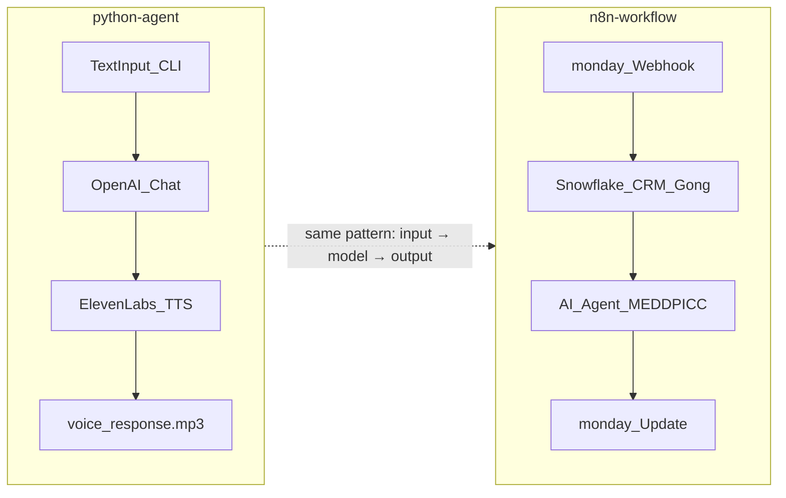
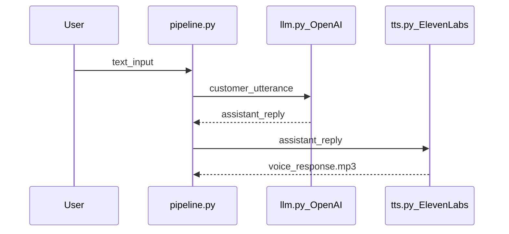
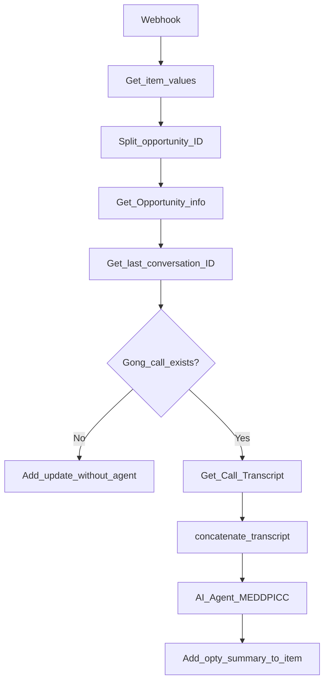

# Enterprise AI Workflows

**Hands-on demos connecting enterprise business workflows with practical AI implementation** — a voice customer agent (Python) and a sales call intelligence automation (n8n).

Built as a solutions-engineering portfolio piece: discovery → prototype → integration design. Not production-hardened software.

---

## Table of contents

- [About this project](#about-this-project)
- [The business problems](#the-business-problems)
- [What this repository contains](#what-this-repository-contains)
- [At a glance](#at-a-glance)
- [Architecture](#architecture)
- [How AI is used](#how-ai-is-used)
- [Enterprise context](#enterprise-context)
- [Example interactions](#example-interactions)
- [Quick start](#quick-start)
- [Project structure](#project-structure)
- [Lessons learned](#lessons-learned)
- [Future improvements](#future-improvements)
- [Scope and limitations](#scope-and-limitations)
- [License](#license)

---

## About this project

Built as a hands-on exploration of enterprise AI patterns — connecting business workflows (CRM, call intelligence, work management) with practical AI implementation. Reflects a solutions/delivery background: discovery → prototype → integration design.

The repository contains **two independent tracks** that share the same underlying pattern (input → model → output), implemented in different tools for different enterprise contexts.

---

## The business problems

### Sales intelligence track

Enterprise sales teams often manage opportunities across multiple systems: a CRM (Salesforce), a conversation intelligence platform (Gong), and a work-management tool (monday.com). When a deal enters a "waiting room" stage, reps and leaders must manually cross-reference call recordings, CRM fields, and board updates to assess deal health and next steps.

**Pain:** slow enrichment, inconsistent qualification, context scattered across tabs.  
**Goal:** automatically enrich the board item with structured sales intelligence when a new opportunity appears.

### Voice agent track

Before investing in telephony, speech-to-text (STT), IVR, or contact-center integrations, stakeholders need to validate the core loop: capture what a customer said → generate a helpful response → deliver it as spoken audio.

**Pain:** expensive platform commitments before the AI + voice integration pattern is proven.  
**Goal:** a runnable prototype that de-risks the voice channel with minimal infrastructure.

---

## What this repository contains

| Folder | Contents | Who uses it |
|--------|----------|-------------|
| [`python-agent/`](python-agent/) | `voice_agent/` package, `main.py`, `tests/`, `requirements.txt`, `.env.example` | Anyone running the **voice CLI** locally or in CI |
| [`n8n-workflow/`](n8n-workflow/) | `sales-intelligence.json` — sanitized export of the **Enrich WaitingRoom Latam** workflow | Solutions / ops importing the graph into **n8n** and wiring credentials there |
| [`docs/`](docs/) | Architecture deep dives, workflow documentation, sample outputs | Readers who want detail without running code |

At the **root** you also have `README.md` (this file), `LICENSE`, `pyproject.toml` (pytest + ruff scoped to `python-agent/`), and `.gitignore`.

**Voice output path:** `python-agent/voice_response.mp3` (created when you run the CLI from `python-agent/`).

---

## At a glance

| | |
|--|--|
| **What** | **(1)** One-turn **voice** prototype: text input → LLM → TTS. **(2)** **n8n workflow**: monday.com · Snowflake · Gong transcript data · AI agent. |
| **Why** | De-risk **voice + AI** and demonstrate **multi-system automation** before heavy platform spend. |
| **Stack** | Python · OpenAI · ElevenLabs · pytest · n8n (workflow JSON) |
| **Status** | Prototype / technical spike — not production-ready |

---

## Architecture

Both tracks follow the same pattern: **input → model → output**. They differ in trigger, orchestration tool, and delivery channel.


```mermaid
flowchart LR
  subgraph voiceAgent [python-agent]
    Input[TextInput_CLI]
    LLM[OpenAI_Chat]
    TTS[ElevenLabs_TTS]
    MP3[voice_response.mp3]
    Input --> LLM --> TTS --> MP3
  end

  subgraph n8nFlow [n8n-workflow]
    WH[monday_Webhook]
    SF[Snowflake_CRM_Gong]
    Agent[AI_Agent_MEDDPICC]
    Update[monday_Update]
    WH --> SF --> Agent --> Update
  end

  voiceAgent -.->|"same pattern: input → model → output"| n8nFlow
```

### Voice agent (Python)

End-to-end pipeline for **each** customer turn inside `python-agent/`:


```mermaid
sequenceDiagram
  participant User
  participant CLI as pipeline.py
  participant LLM as llm.py_OpenAI
  participant TTS as tts.py_ElevenLabs
  User->>CLI: text_input
  CLI->>LLM: customer_utterance
  LLM-->>CLI: assistant_reply
  CLI->>TTS: assistant_reply
  TTS-->>CLI: voice_response.mp3
```

| Stage | Responsibility | Location |
|-------|----------------|----------|
| **User Input** | Capture what the customer said (text today; audio later). | `python-agent/voice_agent/pipeline.py` → `read_customer_input()` |
| **Response Generation** | Turn utterance into assistant text safe to read aloud. | `python-agent/voice_agent/llm.py` → `generate_response()` |
| **Voice Output** | Render that text as speech. | `python-agent/voice_agent/tts.py` → `generate_voice()` → `voice_response.mp3` |

**Orchestration:** `run_single_turn()` in `pipeline.py`. **Config:** `settings.py`. **CLI:** `cli.py` or `python main.py` / `python -m voice_agent` from `python-agent/`.

See [`docs/voice-agent.md`](docs/voice-agent.md) and [`docs/architecture.md`](docs/architecture.md) for more detail.

### Sales call intelligence (n8n)

**Workflow file:** [`n8n-workflow/sales-intelligence.json`](n8n-workflow/sales-intelligence.json) (sanitized n8n export of *Enrich WaitingRoom Latam*).  
Credentials, webhook paths, and sample payloads were **removed or redacted**; configure secrets in your own n8n instance after import.


```mermaid
flowchart TD
  Webhook --> GetItem[Get_item_values]
  GetItem --> SplitID[Split_opportunity_ID]
  SplitID --> OppInfo[Get_Opportunity_info]
  OppInfo --> ConvID[Get_last_conversation_ID]
  ConvID --> Validate{Gong_call_exists?}
  Validate -->|No| NoAnalysis[Add_update_without_agent]
  Validate -->|Yes| Transcript[Get_Call_Transcript]
  Transcript --> Concat[concatenate_transcript]
  Concat --> Agent[AI_Agent_MEDDPICC]
  Agent --> Summary[Add_opty_summary_to_item]
```

See [`docs/n8n-sales-intelligence.md`](docs/n8n-sales-intelligence.md) for the full node-by-node walkthrough.

---

## How AI is used

### Voice agent — single-turn conversational response

| Aspect | Detail |
|--------|--------|
| **Model** | OpenAI Chat Completions (`gpt-4o-mini` by default; override via `OPENAI_MODEL`) |
| **Prompt** | System prompt in `python-agent/voice_agent/settings.py` — instructs concise, natural language suitable for text-to-speech |
| **Mode** | **Single-turn**: one user message in, one assistant reply out. No memory, tools, or retrieval. |
| **Output** | Text reply → ElevenLabs TTS → MP3 file |

The LLM's job is narrow: produce a short, speakable answer. Vendor boundaries are separated so the model or TTS provider can be swapped without changing orchestration.

### n8n workflow — event-driven sales analysis

| Aspect | Detail |
|--------|--------|
| **Model** | OpenAI Chat Model (via n8n LangChain node) |
| **Agent** | n8n AI Agent node with a long domain prompt covering **Command of the Message®** and **MEDDPICC** qualification |
| **Memory** | Redis Chat Memory (n8n LangChain node) |
| **Language** | Prompt and output follow the transcript language (Portuguese in the Latam workflow context) |
| **Mode** | **Event-driven batch analysis**: triggered by a monday.com webhook when a new item appears; analyzes the latest Gong call transcript for that opportunity |
| **Output** | Structured sales intelligence posted as a monday.com item update, with a Gong call link |

The AI agent's job is broader: synthesize CRM context + call transcript into actionable qualification insight for the sales team.

---

## Enterprise context

### Systems and data flow

| System | Role |
|--------|--------|
| **monday.com** | Trigger (webhook on new item) + destination (analysis posted as update) |
| **Snowflake** | Data warehouse holding Salesforce opportunity rows and Gong transcript data |
| **Salesforce** | Source of opportunity metadata (via Snowflake `RAW_SALESFORCE_OPPORTUNITIES`) |
| **Gong** | Conversation intelligence — what was said on the call (via Snowflake tables) |
| **OpenAI** | LLM for both tracks (Chat Completions in Python; Chat Model in n8n) |
| **ElevenLabs** | Text-to-speech for the voice agent |
| **Redis** | Chat memory for the n8n AI Agent node |

### Sanitization

The n8n export is **sanitized for public sharing**:

- Webhook paths and IDs redacted
- Credentials removed (placeholder notes left in JSON)
- No real customer data, API keys, or internal URLs

You must configure your own credentials in n8n after import. The workflow will **not** run out of the box.

### What is not included

- Speech-to-text (STT) or telephony integration
- Multi-turn conversation memory in the Python agent
- Production deployment, monitoring, or rate limiting
- Multi-tenant configuration
- Live CRM or warehouse connections (the n8n export is a reference definition only)

---

## Example interactions

### Voice agent

**User input (after `User:`):**

> *"My subscription renewed at the wrong price yesterday—I need this corrected before the next billing cycle."*

**Assistant response (terminal; illustrative):**

> *"I understand you're seeing an unexpected renewal price…"*

**Voice output:** ElevenLabs produces `python-agent/voice_response.mp3`.

### Sales intelligence agent (fictional sample)

When a Gong call exists, the n8n AI Agent posts structured analysis to the monday.com item. See [`docs/examples/sales-agent-output-sample.md`](docs/examples/sales-agent-output-sample.md) for a **fictional** MEDDPICC-style output — not real customer data.

When no Gong call is linked, the workflow posts a short notice instead of running the agent:

> Automatic update by n8n  
> No Gong conversation is registered for this opportunity.

---

## Quick start

### Voice agent

```bash
cd python-agent
python3 -m venv .venv && source .venv/bin/activate   # Windows: .venv\Scripts\activate
pip install -r requirements.txt
cp .env.example .env   # add OPENAI_API_KEY and ELEVENLABS_API_KEY
python main.py         # or: python -m voice_agent
```

### Tests

From **repository root** (uses root `pyproject.toml`):

```bash
python -m pytest
```

Tests are **unit tests with mocked external APIs** — they verify orchestration and configuration, not live LLM or TTS quality.

### n8n workflow

1. Import `n8n-workflow/sales-intelligence.json` in your n8n instance.
2. Attach credentials for monday.com, Snowflake, OpenAI, and Redis in the n8n UI.
3. Configure the webhook path and connect it to your monday.com integration.

See [`n8n-workflow/README.md`](n8n-workflow/README.md) and [`docs/n8n-sales-intelligence.md`](docs/n8n-sales-intelligence.md) for details.

---

## Project structure

```text
enterprise-ai-workflows/
├── README.md
├── LICENSE
├── pyproject.toml
├── .gitignore
├── docs/
│   ├── architecture.md
│   ├── voice-agent.md
│   ├── n8n-sales-intelligence.md
│   └── examples/
│       └── sales-agent-output-sample.md
├── python-agent/
│   ├── README.md
│   ├── main.py
│   ├── requirements.txt
│   ├── .env.example
│   ├── voice_agent/
│   │   ├── pipeline.py      # orchestration: input → LLM → TTS
│   │   ├── llm.py           # OpenAI Chat Completions
│   │   ├── tts.py           # ElevenLabs TTS
│   │   ├── settings.py      # env vars, prompts, defaults
│   │   └── cli.py           # CLI entry point
│   └── tests/
└── n8n-workflow/
    ├── README.md
    └── sales-intelligence.json
```

---

## Lessons learned

**Visual orchestration (n8n) vs code (Python).** n8n excels when a workflow spans many systems with branching, credentials, and event triggers — as in the sales intelligence flow. Python excels for fast local prototyping of a single integration pattern, like the voice loop. Choosing the right tool depends on who maintains it and how often connectors change.

**Separate boundaries early.** Keeping input capture, LLM reasoning, and TTS output in distinct modules (or n8n nodes) makes vendor swaps straightforward. The voice agent can change from ElevenLabs to another TTS provider by editing one file; the n8n workflow can swap the Chat Model node without restructuring the graph.

**Branch explicitly when data is missing.** The n8n workflow checks for Gong calls before invoking the AI agent. Without that branch, the agent would run on empty transcripts and produce misleading analysis — or fail silently.

**Enterprise prompts need ownership.** The MEDDPICC + Command of the Message prompt in the n8n workflow is long, domain-specific, and in Portuguese (Latam context). Prompts like this require version control, clear ownership, and periodic review — treating them like product configuration, not one-off text.

**Prototype before platform spend.** The CLI voice agent validates the input → model → output loop in minutes, without telephony contracts or STT infrastructure. Stakeholders can hear the output before committing to a full voice channel build.

---

## Future improvements

| Priority | Track | Improvement | Expected outcome |
|----------|-------|-------------|------------------|
| High | Voice | Add STT at the input boundary | Replace CLI typing with real speech input |
| High | Voice | Multi-turn memory + tool calls | Connect to orders, tickets, calendars |
| Medium | Voice | Streaming TTS + WebRTC / SIP | Low-latency spoken UX on phone or web |
| Medium | n8n | Prompt versioning + evaluation set | Measure analysis quality over time |
| Medium | Both | Observability (tracing, cost per run) | Production readiness signals |
| Low | Both | Per-tenant config and rate limits | Multi-customer deployment |

---

## Scope and limitations

This repository is a **prototype for alignment and technical spikes**, not production-hardened software.

- The Python agent runs **single-turn** conversations with **text input** only.
- The n8n workflow is a **sanitized export** — it documents the automation design but requires your own infrastructure to run.
- Tests cover **unit-level orchestration** with mocks, not end-to-end AI quality or integration reliability.
- No deployment configuration, CI/CD pipeline, or hosted demo is included.

---

## License

MIT — see [LICENSE](LICENSE).
