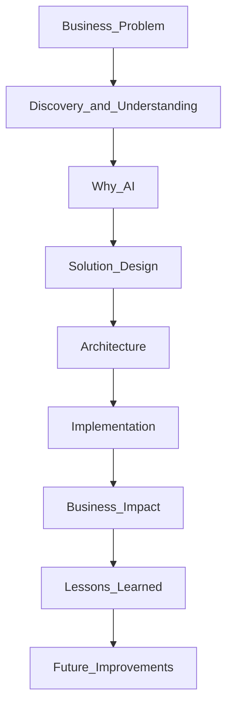
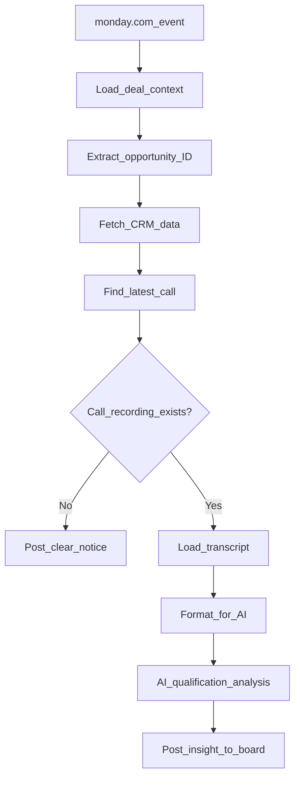
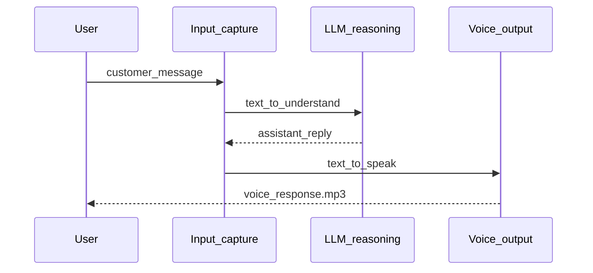
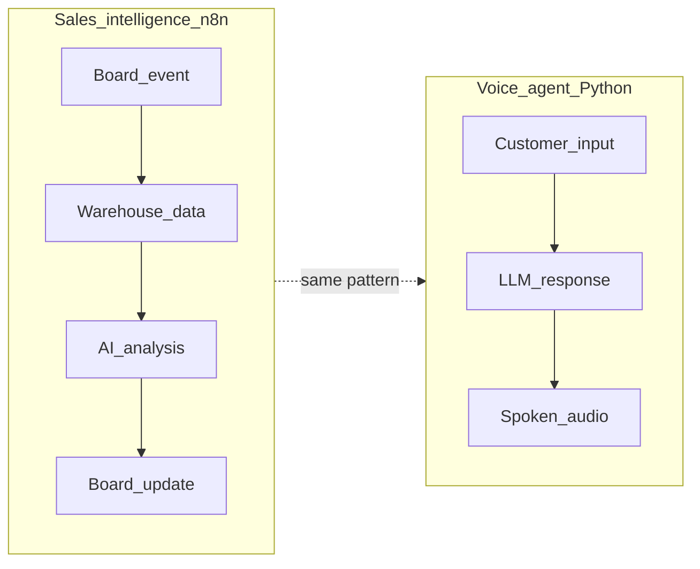

# Enterprise AI Workflows

Practical AI workflow prototypes inspired by real enterprise challenges — exploring how automation, language models, and existing business systems can work together to solve operational problems.

**Status:** Prototype / exploration — not production software.

---

## Table of contents

- [About this repository](#about-this-repository)
- [How to read this portfolio](#how-to-read-this-portfolio)
- [At a glance](#at-a-glance)
- [Track 1 — Sales call intelligence](#track-1--sales-call-intelligence)
- [Track 2 — Voice customer agent](#track-2--voice-customer-agent)
- [Business impact](#business-impact)
- [Discovery mindset](#discovery-mindset)
- [Architecture](#architecture)
- [Implementation](#implementation)
- [Lessons learned](#lessons-learned)
- [Future improvements](#future-improvements)
- [Growing this portfolio](#growing-this-portfolio)
- [Scope and limitations](#scope-and-limitations)
- [Documentation](#documentation)
- [License](#license)

---

## About this repository

This repository contains hands-on AI workflow prototypes shaped by enterprise implementation work — customer discovery, workflow mapping, executive alignment, and rapid proof-of-concept builds.

The goal is **not** to ship production software. It is to show how I approach problems at the intersection of business and technology:

- Start with the operational pain, not the tool
- Understand who is affected and what outcome matters
- Use AI where it genuinely reduces effort or improves decisions
- Design solutions that fit how organizations already work
- Build small, runnable prototypes to validate ideas before platform investment

Each project in this repository follows the same arc: **problem → discovery → design → prototype → impact → reflection**.

If you are evaluating this as a portfolio piece, the README is the narrative. The code and workflow exports are the evidence.

---

## How to read this portfolio


```mermaid
flowchart TD
  Problem[Business_Problem]
  Discovery[Discovery_and_Understanding]
  WhyAI[Why_AI]
  Design[Solution_Design]
  Arch[Architecture]
  Impl[Implementation]
  Impact[Business_Impact]
  Lessons[Lessons_Learned]
  Future[Future_Improvements]

  Problem --> Discovery --> WhyAI --> Design --> Arch --> Impl --> Impact --> Lessons --> Future
```

Both tracks below follow this path. Technical details are in [`docs/`](docs/) for readers who want to go deeper.

---

## At a glance

| | Sales call intelligence | Voice customer agent |
|--|-------------------------|----------------------|
| **Problem** | Reps manually cross-reference CRM, call recordings, and deal boards | Stakeholders need to validate voice AI before telephony investment |
| **Who feels it** | Sales reps, sales leaders, revenue operations | Customer experience teams, support leaders, product owners |
| **Approach** | Event-driven automation (n8n) across existing systems | Minimal Python prototype (input → LLM → speech) |
| **AI role** | Analyze call transcripts into structured qualification insight | Generate concise, speakable customer responses |
| **Artifact** | [`n8n-workflow/sales-intelligence.json`](n8n-workflow/sales-intelligence.json) | [`python-agent/`](python-agent/) |
| **Status** | Sanitized workflow export — requires your own infrastructure | Runnable CLI locally with API keys |

---

## Track 1 — Sales call intelligence

### Business problem

Enterprise sales teams rarely operate in a single system. Opportunity data lives in a CRM. Conversation context lives in a call intelligence platform. Day-to-day execution lives in a work-management tool. When a deal enters a review or "waiting room" stage, reps and leaders must manually connect these sources to answer basic questions:

- What was actually said on the last call?
- Is this opportunity properly qualified?
- What should happen next?

**Who experiences this:** account executives, sales managers, and revenue operations teams supporting complex B2B cycles.

**Why organizations care:** slow deal preparation, inconsistent qualification, and context trapped across tabs reduce pipeline velocity and forecast confidence.

### Discovery and understanding

Before designing automation, the starting questions were operational — not technical:

- Where does the rep's workflow actually begin? *(A new item on the deal board)*
- What data already exists elsewhere? *(CRM records and call transcripts in a data warehouse)*
- What does "done" look like for the user? *(Structured insight posted back to the board, linked to the recording)*
- What happens when expected data is missing? *(A clear notice — not a hallucinated analysis)*

This discovery shaped the workflow: trigger on the board event, pull warehouse data, branch on data availability, then deliver output where reps already work.

### Why AI

The bottleneck is not moving data between systems — it is **reading a 45-minute call transcript and extracting actionable qualification insight** in a consistent format. That is repetitive, time-consuming, and hard to standardize across a team.

AI is appropriate here because:

- The input (call transcript + CRM context) is unstructured text
- The output (qualification framework analysis) requires interpretation, not just lookup
- The task repeats every time a new deal enters the waiting room
- Human reviewers still own the decision — AI accelerates preparation

A rules engine could format data, but not reliably synthesize conversation nuance into MEDDPICC-style insight.

### Solution design

**Design principles:**

1. **Meet users where they work** — output goes back to the deal board, not a new dashboard
2. **Use the warehouse as the integration layer** — CRM and call data already consolidated in Snowflake
3. **Fail gracefully** — if no call recording exists, post a clear notice instead of running analysis on empty input
4. **Encode methodology in the prompt** — qualification framework (MEDDPICC + Command of the Message) becomes repeatable configuration
5. **Keep credentials out of version control** — export sanitized for sharing; secrets configured in the orchestration tool

### Architecture

When a new deal appears on the board, the workflow gathers context from existing systems, applies AI analysis when a call transcript is available, and posts the result back to the board.


```mermaid
flowchart TD
  Webhook[monday.com_event] --> GetItem[Load_deal_context]
  GetItem --> SplitID[Extract_opportunity_ID]
  SplitID --> OppInfo[Fetch_CRM_data]
  OppInfo --> ConvID[Find_latest_call]
  ConvID --> Validate{Call_recording_exists?}
  Validate -->|No| NoAnalysis[Post_clear_notice]
  Validate -->|Yes| Transcript[Load_transcript]
  Transcript --> Concat[Format_for_AI]
  Concat --> Agent[AI_qualification_analysis]
  Agent --> Summary[Post_insight_to_board]
```

**Why each layer exists:**

| Layer | What it does | Why it matters |
|-------|--------------|----------------|
| **Trigger** (webhook) | Starts when a rep creates or moves a deal item | Automation follows the natural workflow moment — no new habit required |
| **Data retrieval** (Snowflake) | Pulls CRM and call transcript data from the warehouse | Avoids point-to-point integrations; uses the organization's existing data hub |
| **Branching** (IF node) | Checks whether a call recording exists | Prevents misleading AI output when input data is incomplete |
| **Formatting** (code node) | Structures the transcript for the model | Raw warehouse data is not model-ready; lightweight transform before AI |
| **AI agent** | Produces structured qualification analysis | The core value: consistent insight from unstructured conversation |
| **Delivery** (board update) | Posts analysis with a link to the recording | Rep sees everything in one place — no tab switching |

See [`docs/n8n-sales-intelligence.md`](docs/n8n-sales-intelligence.md) for the node-by-node walkthrough and [`docs/examples/sales-agent-output-sample.md`](docs/examples/sales-agent-output-sample.md) for a fictional output sample.

### Implementation

The workflow is exported as [`n8n-workflow/sales-intelligence.json`](n8n-workflow/sales-intelligence.json) — a sanitized 14-node n8n graph. Credentials, webhook paths, and internal identifiers were removed. Import into your own n8n instance and configure connectors there.

**This does not run out of the box.** It documents a real automation design, not a hosted service.

### Business impact

| Outcome | How this workflow contributes |
|---------|-------------------------------|
| **Reduced manual effort** | Reps no longer manually read transcripts and write qualification summaries |
| **Faster deal preparation** | Insight appears on the board when the item is created — not hours later |
| **Better decision-making** | Leaders see structured MEDDPICC analysis alongside the deal, not scattered notes |
| **Improved consistency** | Every deal gets the same analytical framework, not ad-hoc rep interpretation |
| **Operational efficiency** | One automated thread replaces tab-hopping across CRM, call intelligence, and board tools |

---

## Track 2 — Voice customer agent

### Business problem

Organizations exploring voice AI — for customer support, notifications, or self-service — face a familiar challenge: telephony, speech recognition, and contact-center platforms require significant investment before anyone can answer a basic question.

**Can a customer speak to the system, get a useful answer, and hear it spoken back?**

Stakeholders need to validate this loop before committing to infrastructure they cannot easily undo.

**Who experiences this:** customer experience leaders, support operations, and product teams evaluating voice as a channel.

**Why organizations care:** voice can improve accessibility and engagement, but only if the underlying AI interaction pattern works. Building the full stack first is expensive and hard to reverse.

### Discovery and understanding

The discovery questions were deliberately narrow:

- What is the minimum loop we need to prove? *(Input → reasoning → spoken output)*
- What can we defer? *(Telephony, STT, multi-turn memory, CRM lookups)*
- Who needs to experience the output? *(Business stakeholders who need to *hear* the response, not read API logs)*
- What does success look like at this stage? *(A runnable demo in minutes, not a deployed service)*

This led to a CLI prototype with text input standing in for speech — validating the reasoning and voice output stages first.

### Why AI

A scripted voice response ("Press 1 for billing") cannot handle the variability of real customer language. The use case requires understanding intent and generating a natural, contextual reply.

AI is appropriate here because:

- Customer questions arrive in unpredictable natural language
- Responses need to be conversational and concise enough to listen to
- The same pipeline can later connect to real data sources (orders, tickets, accounts)

At this stage, the prototype validates the **interaction pattern** — not full customer service automation.

### Solution design

**Design principles:**

1. **Separate capture, reasoning, and speech** — each stage is an independent module with a clear boundary
2. **Defer STT, not the loop** — text input replaces speech input temporarily; downstream stages stay unchanged
3. **Optimize for speakability** — the system prompt instructs concise, natural language suitable for text-to-speech
4. **Make vendor swaps cheap** — LLM and TTS providers are isolated in their own modules
5. **Keep it runnable locally** — stakeholders can experience the output without deployment infrastructure

### Architecture

Each customer interaction follows three stages inside [`python-agent/`](python-agent/):


```mermaid
sequenceDiagram
  participant User
  participant Capture as Input_capture
  participant Reason as LLM_reasoning
  participant Speak as Voice_output
  User->>Capture: customer_message
  Capture->>Reason: text_to_understand
  Reason-->>Capture: assistant_reply
  Capture->>Speak: text_to_speak
  Speak-->>User: voice_response.mp3
```

**Why each stage exists:**

| Stage | What it does | Why it matters |
|-------|--------------|----------------|
| **Input capture** | Receives what the customer said (CLI text today; STT later) | Separating input from reasoning means adding speech recognition does not require rebuilding the AI layer |
| **LLM reasoning** | Generates a helpful, speakable response | The core intelligence — understands intent and produces a natural answer |
| **Voice output** | Converts text to spoken audio (MP3) | Stakeholders experience the *customer-facing* result, not just terminal text |

The same input → model → output pattern appears in the sales intelligence track — implemented in n8n instead of Python, delivering text instead of speech.

See [`docs/voice-agent.md`](docs/voice-agent.md) and [`docs/architecture.md`](docs/architecture.md) for technical detail.

### Implementation

```bash
cd python-agent
python3 -m venv .venv && source .venv/bin/activate
pip install -r requirements.txt
cp .env.example .env   # add OPENAI_API_KEY and ELEVENLABS_API_KEY
python main.py
```

Type a message after the `User:` prompt. The reply prints to the terminal and an MP3 is saved to `voice_response.mp3`.

**Example input:**

> *"My subscription renewed at the wrong price yesterday—I need this corrected before the next billing cycle."*

Tests (from repository root): `python -m pytest` — unit tests with mocked APIs, verifying orchestration rather than live AI quality.

### Business impact

| Outcome | How this prototype contributes |
|---------|-------------------------------|
| **Reduced platform risk** | Validates the voice loop before telephony or contact-center contracts |
| **Faster stakeholder alignment** | Decision-makers hear the output, not just read architecture slides |
| **Better customer engagement potential** | Proves spoken responses feel natural enough to pursue as a channel |
| **Increased scalability path** | Modular design means each stage can be upgraded independently as requirements grow |

---

## Business impact

Across both tracks, the underlying value is the same: **reduce manual effort, improve consistency, and help people make better decisions faster** — using AI as a practical layer within existing enterprise workflows, not as a standalone product.

| Dimension | Sales intelligence | Voice agent |
|-----------|-------------------|-------------|
| Manual effort | Eliminates transcript reading and summary writing | Eliminates guesswork about voice AI feasibility |
| Speed | Insight at deal creation, not hours later | Demo in minutes, not months of integration |
| Consistency | Same qualification framework every time | Same interaction pattern every turn |
| Decision quality | Structured analysis where reps already work | Audible proof before infrastructure commitment |
| Scalability | Event-driven — runs for every new deal automatically | Modular — each stage upgrades independently |

---

## Discovery mindset

Enterprise AI solutions do not start with model selection. They start with understanding how people work today.

Questions that shaped both projects:

- **Who** performs this task today, and what does their day look like?
- **Where** does the workflow begin and end — and which systems are already involved?
- **What** does the user need to see or hear to take action?
- **When** should automation run — and when should it stay out of the way?
- **Why** would AI help here specifically, versus a simpler automation?

These questions appear throughout the documentation because they are the part that scales across customers, industries, and tools. The technology changes. The discovery discipline does not.

See [`docs/discovery.md`](docs/discovery.md) for the framework in more detail.

---

## Architecture

Both tracks share one pattern: **capture input → apply AI reasoning → deliver output where users already work.**


```mermaid
flowchart LR
  subgraph track1 [Sales_intelligence_n8n]
    WH[Board_event]
    Data[Warehouse_data]
    AI1[AI_analysis]
    Out1[Board_update]
    WH --> Data --> AI1 --> Out1
  end

  subgraph track2 [Voice_agent_Python]
    In[Customer_input]
    AI2[LLM_response]
    Out2[Spoken_audio]
    In --> AI2 --> Out2
  end

  track1 -.->|"same pattern"| track2
```

**Why this structure:**

- **Event-driven trigger** (track 1) or **interactive input** (track 2) — matches how the user naturally starts the workflow
- **Existing systems as data sources** — no rip-and-replace; AI layers onto what the organization already has
- **AI in the middle** — handles interpretation and generation, not data transport
- **Output where users work** — board update or audio file, not a new tool to adopt

For readers who want component-level detail, see [`docs/architecture.md`](docs/architecture.md).

---

## Implementation

### Repository structure

```text
enterprise-ai-workflows/
├── README.md                          ← you are here
├── docs/
│   ├── architecture.md                ← design decisions
│   ├── discovery.md                   ← discovery framework
│   ├── voice-agent.md                 ← voice track deep dive
│   ├── n8n-sales-intelligence.md      ← sales track deep dive
│   ├── portfolio-roadmap.md           ← future repository ideas
│   └── examples/
│       └── sales-agent-output-sample.md
├── python-agent/                      ← voice customer agent (runnable)
└── n8n-workflow/                      ← sales intelligence (importable)
```

### Quick reference

| Track | How to use it | Documentation |
|-------|---------------|---------------|
| Voice agent | Run locally from `python-agent/` | [`python-agent/README.md`](python-agent/README.md) |
| Sales intelligence | Import JSON into n8n | [`n8n-workflow/README.md`](n8n-workflow/README.md) |

---

## Lessons learned

These insights come from building and deploying enterprise AI workflows — not from reading about them.

**Start with the workflow, not the model.** The most common mistake in enterprise AI projects is choosing technology before understanding the operational moment where value appears. Both tracks began with "when does the rep need this?" and "what does the customer hear?" — not "which LLM should we use?"

**Prototype to create clarity, not to ship.** Ambiguity is normal in early-stage enterprise AI work. A runnable prototype — even a CLI demo or a sanitized workflow export — gives stakeholders something concrete to react to. That reaction is more valuable than a perfect specification.

**Design for missing data.** Enterprise systems are never fully connected. The sales workflow explicitly branches when no call recording exists. Assuming complete data leads to silent failures or hallucinated output — both erode trust faster than doing nothing.

**Separate what changes from what stays.** LLM providers, TTS vendors, and orchestration tools will change. Input boundaries, output destinations, and business rules change less often. Architecture should reflect that.

**Prompts are product configuration.** The MEDDPICC analysis prompt is long, domain-specific, and requires ownership — versioning, review, and evaluation like any other business rule. Treating prompts as throwaway text is a common source of quality drift.

**Adoption beats capability.** The best AI analysis is worthless if it lands somewhere reps do not look. Both designs deliver output in the user's existing workspace — the board update, the audible response — rather than introducing a new destination.

**Balance ambition with honesty.** These are prototypes. Labeling them clearly builds credibility. Overstating readiness destroys it.

---

## Future improvements

Ideas that naturally extend from this work — grouped by theme, not all planned for implementation.

### Interaction and intelligence

| Idea | Track | Rationale |
|------|-------|-----------|
| Multi-turn memory | Voice | Real conversations require context across turns |
| Tool calls (orders, tickets, accounts) | Voice | Connect responses to live business data |
| Speech-to-text at input boundary | Voice | Replace CLI typing with real voice input |
| Prompt evaluation set | Sales | Measure analysis quality against a labeled dataset |
| Human-in-the-loop review | Sales | Let managers approve or edit AI analysis before it posts |

### Operations and trust

| Idea | Track | Rationale |
|------|-------|-----------|
| Observability (tracing, cost per run) | Both | Production deployments need visibility into AI behavior and spend |
| Governance and audit logging | Both | Enterprise customers need to know what the AI did and when |
| Security review for data flows | Sales | Transcript data crossing systems requires explicit access controls |
| Rate limiting and error handling | Both | Real workloads need graceful degradation |

### Scale and delivery

| Idea | Track | Rationale |
|------|-------|-----------|
| Streaming TTS + telephony integration | Voice | Low-latency spoken UX on phone or web channels |
| Multi-agent collaboration | Sales | Separate agents for qualification, competitive analysis, and next-step recommendation |
| Per-tenant configuration | Both | Different teams or customers may need different prompts and rules |
| Deployment patterns (CI/CD for workflows) | Sales | Version-controlled automation with staged rollout |

---

## Growing this portfolio

This repository is one piece of a broader professional portfolio. See [`docs/portfolio-roadmap.md`](docs/portfolio-roadmap.md) for suggested future repositories that would strengthen positioning in enterprise AI implementation — each tied to a real operational problem, not an isolated coding exercise.

---

## Scope and limitations

This repository is intentionally scoped as a **prototype and exploration**, not production software.

- The voice agent handles **single-turn, text-input** interactions only
- The n8n workflow is a **sanitized export** — it documents design but requires your own infrastructure
- Tests verify **orchestration logic** with mocks, not live AI quality
- No deployment, monitoring, CI/CD, or hosted demo is included
- No customer data, credentials, or internal system URLs are committed

Credibility comes from accuracy, not completeness.

---

## Documentation

| Document | Purpose |
|----------|---------|
| [`docs/discovery.md`](docs/discovery.md) | Discovery framework for enterprise AI work |
| [`docs/architecture.md`](docs/architecture.md) | Design decisions and component responsibilities |
| [`docs/voice-agent.md`](docs/voice-agent.md) | Voice track technical deep dive |
| [`docs/n8n-sales-intelligence.md`](docs/n8n-sales-intelligence.md) | Sales track node-by-node walkthrough |
| [`docs/examples/sales-agent-output-sample.md`](docs/examples/sales-agent-output-sample.md) | Fictional MEDDPICC output sample |
| [`docs/portfolio-roadmap.md`](docs/portfolio-roadmap.md) | Future repository ideas for this portfolio |

---

## License

MIT — see [LICENSE](LICENSE).
