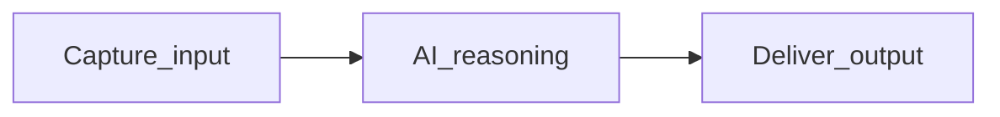
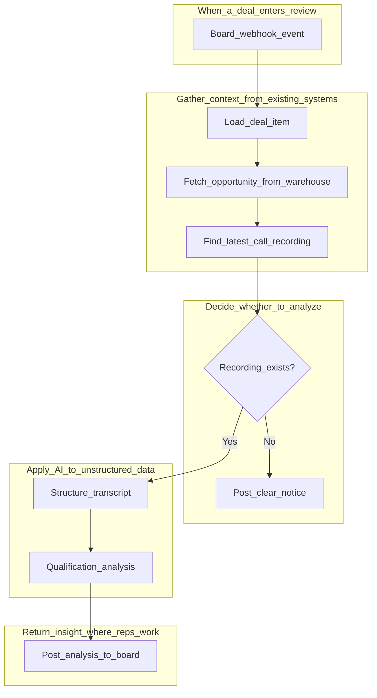
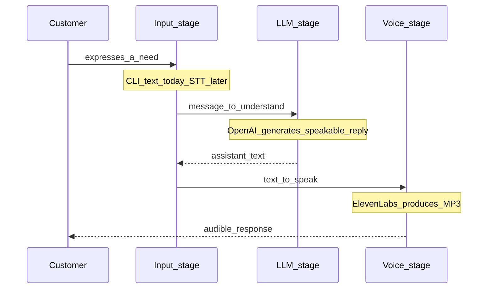
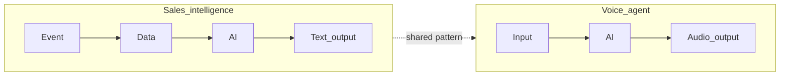

# Architecture

Design decisions and component responsibilities for both tracks. Written for readers who want to understand **why** the solution is structured this way — not just what each file does.

---

## The shared pattern

Every AI workflow in this portfolio follows the same abstract shape:

In enterprise deployments, each stage often maps to a different concern:

| Stage | Typical owner | What can change |
|-------|---------------|-----------------|
| **Capture** | Integration / platform team | Input channel (webhook, CLI, API, phone) |
| **Reason** | AI / data team | Model, prompt, tools, evaluation |
| **Deliver** | Product / operations team | Output destination (board, email, audio, dashboard) |

Separating these stages early makes the solution adaptable as requirements evolve — which they always do in enterprise work.

---

## Track 1 — Sales call intelligence

### Information flow

### Component responsibilities

| Component | Business purpose | Technical role |
|-----------|-----------------|----------------|
| **Webhook trigger** | Automation starts when the rep's workflow starts — no new action required | Receives monday.com event when a deal item is created |
| **Item loader** | Deal context (name, columns, IDs) is needed before querying other systems | Fetches the board item via monday.com API |
| **Opportunity ID extractor** | CRM data requires a key to look up — extracted from a board column | Code node reads Salesforce opportunity ID from column `text1` |
| **Warehouse queries** | CRM and call data already live in one place — use it | Snowflake queries against Salesforce and Gong tables |
| **Branch check** | Missing data should not produce fake analysis | IF node validates Gong call existence |
| **Transcript formatter** | Raw warehouse data is not readable by the model | Code node structures speaker blocks with timestamps |
| **AI agent** | The core value — consistent qualification insight from conversation | LangChain agent with MEDDPICC + Command of the Message prompt |
| **Board update** | Rep sees the result where they already work | Posts analysis as item update with Gong call link |

### Why this architecture

- **Warehouse as hub:** Avoids building point-to-point integrations between CRM, call intelligence, and board tools. The organization already invested in consolidating data — the workflow leverages that.
- **Branch before AI:** Enterprise data is always incomplete. Explicit branching builds trust; silent failures destroy it.
- **Output to existing workspace:** Adoption depends on meeting users where they are, not introducing a new tool.
- **Prompt as configuration:** The qualification methodology is encoded in the agent prompt — versionable, reviewable, and owned by the business team.

---

## Track 2 — Voice customer agent

### Information flow

### Component responsibilities

| Component | Business purpose | Technical role |
|-----------|-----------------|----------------|
| **Input capture** | Receive what the customer said — by any channel | `read_customer_input()` — CLI text today; STT boundary later |
| **LLM reasoning** | Understand intent and generate a helpful, concise reply | `generate_response()` — OpenAI Chat Completions |
| **Voice output** | Let stakeholders *hear* the customer experience | `generate_voice()` — ElevenLabs TTS → MP3 |
| **Orchestration** | Run the three stages in order with clear error handling | `run_single_turn()` in `pipeline.py` |
| **Configuration** | Centralize prompts, API keys, and defaults | `settings.py` |

### Why this architecture

- **Deferred STT:** Speech recognition adds complexity without validating the core question — "does the AI response sound right when spoken?" Text input answers that first.
- **Module boundaries:** Each stage is a separate file. Swapping OpenAI for another LLM, or ElevenLabs for another TTS provider, requires changing one module — not rebuilding the pipeline.
- **Speakability by design:** The system prompt optimizes for concise, natural language — because the output will be heard, not read.
- **Local runnable:** No deployment infrastructure needed for stakeholders to experience the output.

---

## How the tracks relate

Both tracks prove the same thesis: **AI creates value when it sits inside an existing workflow, receives the right input, and delivers output where users already work.**

In a full enterprise deployment, these could connect — the sales analysis becoming content that a voice channel delivers to a manager. This repository keeps them independent so each can be understood and evaluated on its own.

---

## Design decision summary

| Decision | Track | Rationale |
|----------|-------|-----------|
| Use warehouse as data hub | Sales | Leverage existing data investment; avoid new integrations |
| Branch on missing data | Sales | Prevent misleading AI output; maintain user trust |
| Deliver to existing workspace | Sales | Adoption requires zero new habits |
| Defer STT | Voice | Validate reasoning + speech before adding speech recognition |
| Separate LLM and TTS modules | Voice | Vendor independence; easier testing and swapping |
| Single-turn only | Voice | Simplest valid prototype; complexity added when validated |
| Sanitized workflow export | Sales | Share design publicly without exposing credentials |
| Unit tests with mocks | Voice | Verify orchestration without live API dependency |

---

## Related documentation

- [Discovery framework](discovery.md)
- [Voice agent deep dive](voice-agent.md)
- [n8n workflow walkthrough](n8n-sales-intelligence.md)
- [Root README](../README.md)
