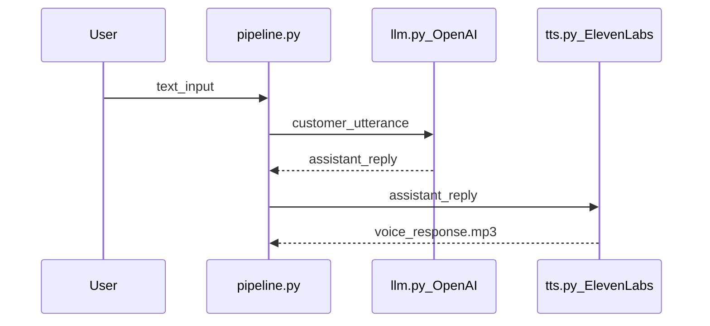
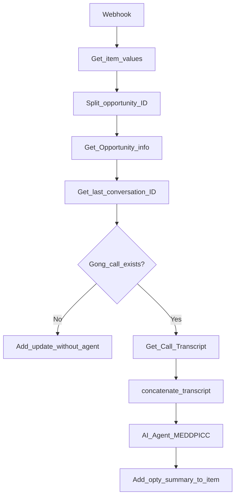
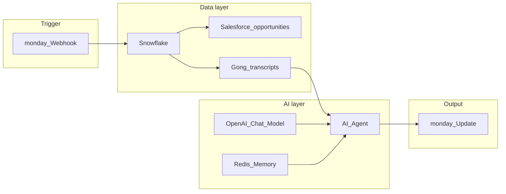
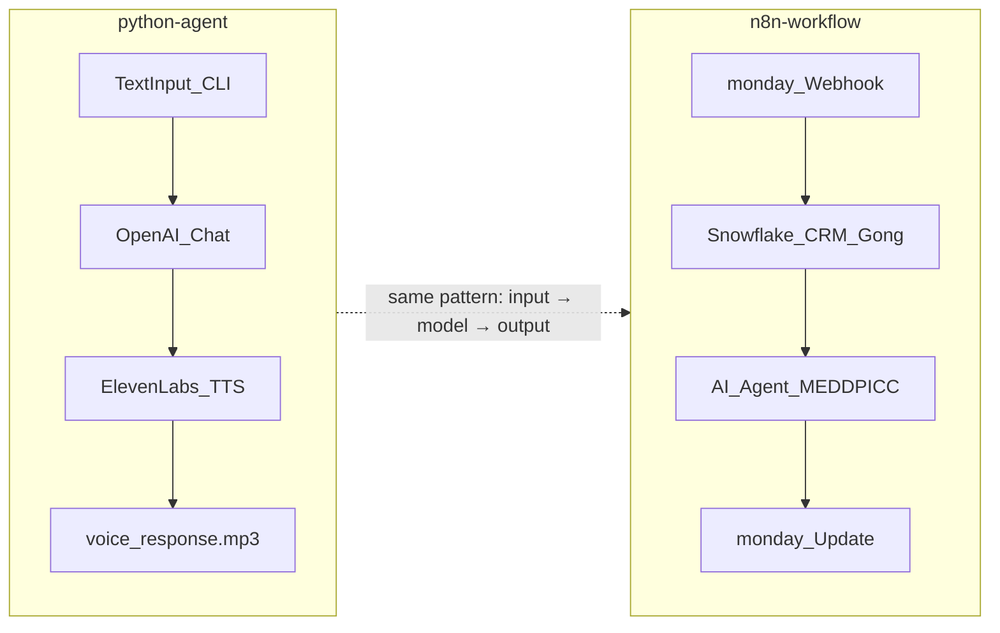

# Architecture

This document describes the design of both tracks in this repository and the reasoning behind key decisions.

---

## Shared pattern: input → model → output

Both the Python voice agent and the n8n sales intelligence workflow follow the same abstract pipeline:

1. **Capture** — receive input (CLI text, webhook event + data fetch)
2. **Reason** — LLM generates a response or analysis
3. **Deliver** — output to the user (MP3 file, monday.com update)

This separation is intentional. In enterprise deployments, each stage often maps to a different team, vendor, or compliance boundary.

---

## Voice agent architecture

### Sequence diagram

### Module responsibilities

| Module | File | Responsibility |
|--------|------|----------------|
| Orchestration | `voice_agent/pipeline.py` | Runs one turn: input → LLM → TTS |
| Input | `pipeline.py` → `read_customer_input()` | CLI text capture (STT placeholder) |
| Reasoning | `voice_agent/llm.py` | OpenAI Chat Completions call |
| Speech | `voice_agent/tts.py` | ElevenLabs REST API → MP3 |
| Config | `voice_agent/settings.py` | Env vars, system prompt, defaults |
| Entry | `voice_agent/cli.py`, `main.py` | CLI with exit codes |

### Design decisions

| Decision | Rationale |
|----------|-----------|
| Text input instead of STT | De-risks the LLM + TTS loop before adding speech recognition complexity |
| Single-turn only | Simplest valid prototype; multi-turn requires memory and state management |
| Injectable OpenAI client in `llm.py` | Enables unit tests without live API calls |
| Separate `llm.py` and `tts.py` | Vendor swap requires changing one module, not the orchestrator |
| `.env` loaded from `python-agent/` root | Runs consistently regardless of shell working directory |

---

## n8n sales intelligence architecture

### Flow diagram

### High-level overview

### Design decisions

| Decision | Rationale |
|----------|-----------|
| Snowflake as data hub | CRM and Gong data already consolidated in the warehouse — one query layer |
| Branch before AI agent | Avoids running analysis when no Gong call exists |
| Code nodes for ID extraction and transcript formatting | Lightweight transforms without external dependencies |
| Long domain prompt in AI Agent node | Encodes sales methodology (MEDDPICC + Command of the Message) as configuration |
| Redis Chat Memory | n8n LangChain pattern for agent context within a single run |
| Sanitized export in git | Documents the workflow design without exposing credentials or internal paths |

---

## How the two tracks relate

The voice agent demonstrates how **spoken delivery** could sit on top of the same intelligence that the n8n workflow produces in text form. In a full enterprise deployment, the n8n analysis could feed a voice channel — but this repository keeps them as independent, runnable demos.

---

## Related documentation

- [Voice agent deep dive](voice-agent.md)
- [n8n workflow walkthrough](n8n-sales-intelligence.md)
- [Root README](../README.md)
