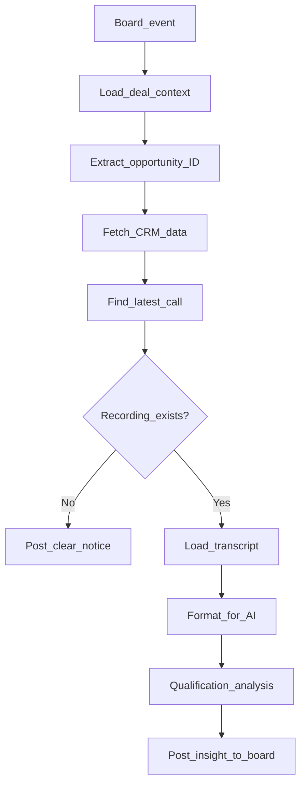

# Sales Call Intelligence Workflow

Track 1 of this portfolio — event-driven automation that enriches deal board items with AI-generated qualification insight from call transcripts.

For the full narrative (problem, discovery, impact), see the [root README](../README.md#track-1--sales-call-intelligence). This document covers the workflow in detail.

---

## Business context

**Problem:** Sales reps manually cross-reference CRM data, call recordings, and deal boards to assess opportunity health — slow, inconsistent, and scattered across tabs.

**Discovery conclusion:** Automation should trigger when the rep creates a deal item, pull data from the warehouse, analyze the latest call transcript, and post structured insight back to the board.

**What this workflow proves:** AI can consistently produce qualification analysis inside an existing multi-system workflow — without requiring reps to change how they work.

---

## Architecture

---

## Node-by-node walkthrough

| # | Node | Business purpose |
|---|------|-----------------|
| 1 | **Webhook** | Starts when a deal item is created on the board |
| 2 | **Respond to Webhook** | Completes the integration handshake with monday.com |
| 3 | **Get item values** | Loads deal context (name, columns, IDs) |
| 4 | **Split opportunity ID** | Extracts Salesforce opportunity ID from board column |
| 5 | **Get Opportunity info** | Fetches CRM data from the warehouse |
| 6 | **Get last conversation ID** | Finds the latest Gong-linked call for this opportunity |
| 7 | **Validate if have gong calls** | Branches: proceed only if a call recording exists |
| 8a | **Add update without agent analysis** | *(No-call branch)* Posts a clear notice |
| 8b | **Get Call Transcript** | *(Call-exists branch)* Loads transcript from warehouse |
| 9 | **concatenate the transcript** | Formats transcript blocks for the AI model |
| 10 | **AI Agent** | Produces MEDDPICC + Command of the Message analysis |
| 11 | **OpenAI Chat Model** | LLM backend for the agent |
| 12 | **Redis Chat Memory** | Agent memory within the run |
| 13 | **Add opty summary as update to item** | Posts analysis to the board with Gong call link |

---

## Why AI fits this workflow

| Task | Without AI | With AI |
|------|-----------|---------|
| Read 45-min transcript | Rep spends 20–30 minutes | Automated in seconds |
| Extract qualification signals | Inconsistent across reps | Same MEDDPICC framework every time |
| Write structured summary | Ad-hoc notes on the board | Consistent format with actionable next steps |
| Link to recording | Manual copy-paste | Included automatically in the update |

Human judgment still drives the deal decision. AI accelerates preparation.

---

## Import instructions

1. Open n8n → **Workflows** → **Import from File**
2. Select [`sales-intelligence.json`](../n8n-workflow/sales-intelligence.json)
3. Configure credentials: monday.com, Snowflake, OpenAI, Redis
4. Set the webhook path (redacted in export)
5. Connect to your monday.com integration and activate

**Will not run out of the box.** All credentials were removed during sanitization.

---

## Sample output

See [`examples/sales-agent-output-sample.md`](examples/sales-agent-output-sample.md) for a fictional MEDDPICC analysis — illustrating format, not real data.

---

## Related documentation

- [Root README — Track 1](../README.md#track-1--sales-call-intelligence)
- [Architecture](architecture.md)
- [Discovery framework](discovery.md)
- [n8n-workflow README](../n8n-workflow/README.md)
