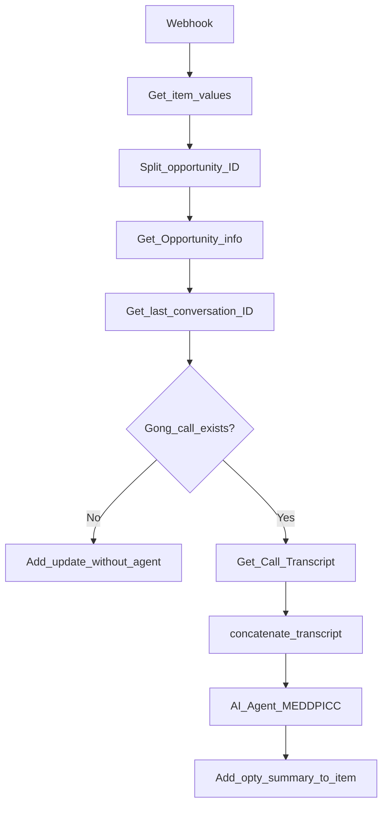

# n8n Sales Intelligence Workflow

Deep dive into the sanitized n8n export in [`n8n-workflow/sales-intelligence.json`](../n8n-workflow/sales-intelligence.json).

**Original name:** Enrich WaitingRoom Latam  
**Nodes:** 14  
**Context:** Latam sales team — prompt and output in Portuguese

---

## Purpose

When a new opportunity appears on a monday.com "waiting room" board, automatically enrich the item with structured sales intelligence derived from the latest Gong call transcript and Salesforce opportunity data.

---

## Architecture

---

## Node-by-node walkthrough

| # | Node | Type | What it does |
|---|------|------|--------------|
| 1 | **Webhook** | Webhook | Receives POST from monday.com when a new item is created |
| 2 | **Respond to Webhook** | Respond to Webhook | Returns the monday.com challenge for integration verification |
| 3 | **Get item values** | monday.com | Loads the pulse (item) data including column values |
| 4 | **Split opportunity ID** | Code | Extracts the Salesforce opportunity ID from monday column `text1` |
| 5 | **Get Opportunity info** | Snowflake | Queries `RAW_SALESFORCE_OPPORTUNITIES` for the opportunity |
| 6 | **Get last conversation ID** | Snowflake | Finds the latest Gong-linked conversation for that opportunity |
| 7 | **Validate if have gong calls on SFDC** | IF | Branches based on whether a Gong call exists |
| 8a | **Add update without agent analysis** | monday.com | *(No-call branch)* Posts a notice that no Gong conversation exists |
| 8b | **Get Call Transcript** | Snowflake | *(Call-exists branch)* Loads the Gong transcript from Snowflake |
| 9 | **concatenate the transcript** | Code | Formats transcript blocks with speaker IDs and timestamps into one string |
| 10 | **AI Agent** | LangChain Agent | Runs MEDDPICC + Command of the Message analysis on the transcript |
| 11 | **OpenAI Chat Model** | LangChain LM | Provides the LLM backend for the AI Agent node |
| 12 | **Redis Chat Memory** | LangChain Memory | Chat memory for the agent within the run |
| 13 | **Add opty summary as update to item** | monday.com | Posts the AI analysis as an item update with a Gong call link |

---

## Branching logic

The **Validate if have gong calls on SFDC** IF node is critical:

- **No Gong call:** workflow posts a short notice to monday.com and stops. No AI agent runs.
- **Gong call exists:** workflow fetches the transcript, formats it, runs the AI agent, and posts structured analysis.

This prevents the agent from running on empty or missing data.

---

## How AI is used

| Component | Role |
|-----------|------|
| **AI Agent node** | Orchestrates the analysis using a long domain prompt covering Command of the Message® methodology and MEDDPICC qualification framework |
| **OpenAI Chat Model** | LLM backend (configured via n8n credentials) |
| **Redis Chat Memory** | Provides chat memory context for the LangChain agent pattern |

The prompt instructs the agent to analyze the call transcript in the transcript's language (Portuguese in the Latam context) and produce structured sales intelligence covering metrics, economic buyer, decision criteria, pain points, and next steps.

See [`examples/sales-agent-output-sample.md`](examples/sales-agent-output-sample.md) for a fictional example of the output format.

---

## Systems involved

| System | Role |
|--------|------|
| **monday.com** | Event trigger + analysis destination |
| **Snowflake** | Data warehouse for Salesforce and Gong data |
| **Salesforce** | Opportunity metadata (via Snowflake) |
| **Gong** | Call transcripts (via Snowflake) |
| **OpenAI** | LLM for analysis |
| **Redis** | Agent memory |

---

## Import instructions

1. Open your n8n instance.
2. Go to **Workflows** → **Import from File**.
3. Select `n8n-workflow/sales-intelligence.json`.
4. Configure credentials in the n8n UI for:
   - monday.com (bbMondayCom node)
   - Snowflake (bbBigBrainSnowflake node)
   - OpenAI (lmChatOpenAi node)
   - Redis (memoryRedisChat node)
5. Set the webhook path (currently redacted as `REDACTED_WEBHOOK_PATH`).
6. Connect the webhook to your monday.com integration.
7. Activate the workflow.

**The workflow will not run out of the box.** All credentials and webhook paths were removed during sanitization.

---

## Sanitization notes

The committed JSON is safe for public sharing:

- Webhook paths and IDs replaced with `REDACTED` placeholders
- Credential objects contain `_note` placeholders instead of real secrets
- No customer data, internal URLs, or API keys

When importing, n8n will prompt you to map or create new credentials for each connector.

---

## Related documentation

- [Architecture overview](architecture.md)
- [Sample agent output](examples/sales-agent-output-sample.md)
- [n8n-workflow README](../n8n-workflow/README.md)
