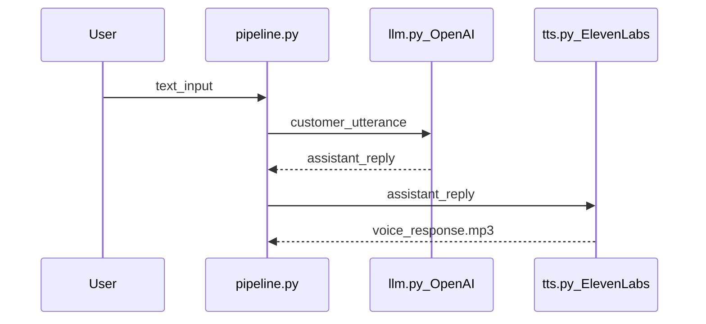

# Voice Agent

Deep dive into the Python voice customer agent in [`python-agent/`](../python-agent/).

---

## Purpose

Validate the core voice AI loop — input → LLM response → spoken audio — before investing in telephony, STT, or contact-center infrastructure.

**Current scope:** single-turn, text-input CLI prototype. Not a production voice bot.

---

## Pipeline



### Stage 1 — User input

**File:** `voice_agent/pipeline.py` → `read_customer_input()`

Captures customer text via CLI `input()`. This boundary is designed to be replaced with speech-to-text (STT) without changing downstream stages.

### Stage 2 — Response generation

**File:** `voice_agent/llm.py` → `generate_response()`

Calls OpenAI Chat Completions with:

- **Model:** `gpt-4o-mini` (default; override with `OPENAI_MODEL` env var)
- **System prompt:** defined in `voice_agent/settings.py` — instructs concise, natural language suitable for text-to-speech

The `client` parameter is injectable for unit tests.

### Stage 3 — Voice output

**File:** `voice_agent/tts.py` → `generate_voice()`

Calls ElevenLabs REST API (`/v1/text-to-speech/{voice_id}`) and writes the result to `voice_response.mp3` in the `python-agent/` directory.

Default voice ID and stability settings are in `settings.py`.

---

## Environment variables

Copy `.env.example` to `.env` in `python-agent/`:

| Variable | Required | Default | Description |
|----------|----------|---------|-------------|
| `OPENAI_API_KEY` | Yes | — | OpenAI API key |
| `ELEVENLABS_API_KEY` | Yes | — | ElevenLabs API key |
| `OPENAI_MODEL` | No | `gpt-4o-mini` | OpenAI model name |

---

## Quick start

```bash
cd python-agent
python3 -m venv .venv && source .venv/bin/activate
pip install -r requirements.txt
cp .env.example .env
python main.py
```

Type a message after the `User:` prompt. The assistant reply prints to the terminal and an MP3 is saved to `voice_response.mp3`.

---

## Module reference

| File | Exports | Role |
|------|---------|------|
| `pipeline.py` | `read_customer_input()`, `run_single_turn()` | Orchestrates one turn |
| `llm.py` | `generate_response()` | OpenAI Chat Completions |
| `tts.py` | `generate_voice()` | ElevenLabs TTS → MP3 |
| `settings.py` | env loaders, constants, `SYSTEM_PROMPT` | Configuration |
| `cli.py` | `main()` | CLI entry with error handling |

---

## Tests

From repository root:

```bash
python -m pytest
```

Three test files cover:

- `test_llm.py` — injected OpenAI client, message structure
- `test_pipeline.py` — turn orchestration order, empty input rejection
- `test_settings.py` — missing env var handling

All tests use mocks — no live API calls.

---

## Extending the agent

These are documented future directions, not implemented features:

| Extension | Where to change | Notes |
|-----------|-----------------|-------|
| Speech-to-text | Replace `read_customer_input()` in `pipeline.py` | Keep LLM and TTS unchanged |
| Multi-turn memory | Add state to `pipeline.py` or `llm.py` | Pass conversation history in messages array |
| Tool calls / APIs | Extend `llm.py` | Add function calling for orders, tickets, etc. |
| Different TTS vendor | Replace body of `tts.py` | Keep `generate_voice()` signature |
| Different LLM provider | Replace body of `llm.py` | Keep `generate_response()` signature |

---

## Related documentation

- [Architecture overview](architecture.md)
- [Root README](../README.md)
