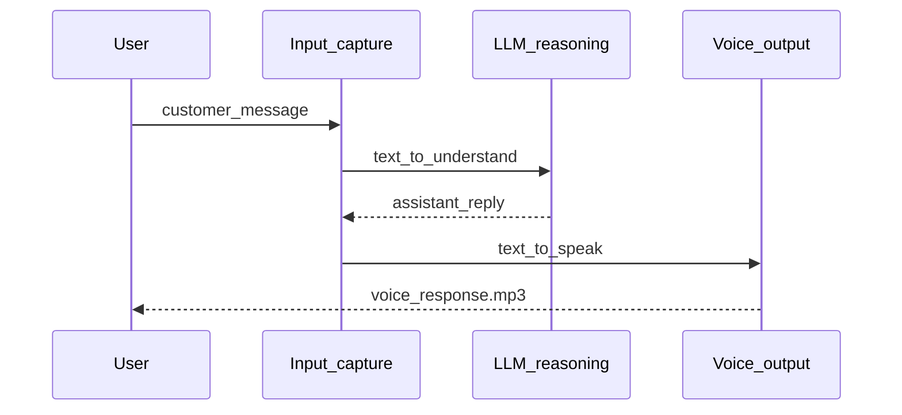

# Voice Customer Agent

Track 2 of this portfolio — validating the input → reasoning → spoken output loop before investing in telephony infrastructure.

For the full narrative (problem, discovery, impact), see the [root README](../README.md#track-2--voice-customer-agent). This document covers technical detail.

---

## Business context

**Problem:** Organizations want to explore voice AI but cannot commit to contact-center or telephony platforms without proof the interaction pattern works.

**Discovery conclusion:** The minimum viable validation is a runnable loop where a customer message produces an audible AI response. Telephony, STT, multi-turn memory, and CRM integration can wait.

**What this prototype proves:** The AI can generate responses natural enough to speak aloud — and stakeholders can hear the result in minutes.

---

## Pipeline



| Stage | Module | Business role |
|-------|--------|---------------|
| Input capture | `pipeline.py` → `read_customer_input()` | Receives customer need (CLI text; STT later) |
| LLM reasoning | `llm.py` → `generate_response()` | Understands intent; produces speakable reply |
| Voice output | `tts.py` → `generate_voice()` | Converts reply to audio stakeholders can hear |

---

## Environment variables

Copy `.env.example` to `.env` in this directory:

| Variable | Required | Default | Description |
|----------|----------|---------|-------------|
| `OPENAI_API_KEY` | Yes | — | OpenAI API key |
| `ELEVENLABS_API_KEY` | Yes | — | ElevenLabs API key |
| `OPENAI_MODEL` | No | `gpt-4o-mini` | Model for response generation |

---

## Quick start

```bash
cd python-agent
python3 -m venv .venv && source .venv/bin/activate
pip install -r requirements.txt
cp .env.example .env
python main.py
```

Type a message after `User:`. Reply prints to terminal; MP3 saved to `voice_response.mp3`.

---

## Tests

From repository root:

```bash
python -m pytest
```

Unit tests with mocked APIs — verify orchestration order and error handling, not live AI quality.

---

## Module reference

| File | Role |
|------|------|
| `pipeline.py` | Orchestrates one turn: input → LLM → TTS |
| `llm.py` | OpenAI Chat Completions (swappable provider) |
| `tts.py` | ElevenLabs TTS → MP3 (swappable provider) |
| `settings.py` | Env vars, system prompt, defaults |
| `cli.py` | CLI entry with clear exit codes |

---

## Natural extensions (not implemented)

| Extension | Where to change | Why it matters |
|-----------|-----------------|----------------|
| Speech-to-text | Replace `read_customer_input()` | Real voice input instead of CLI typing |
| Multi-turn memory | Extend `llm.py` messages array | Conversations require context |
| Tool calls | Extend `llm.py` with function calling | Connect to orders, tickets, accounts |
| Streaming TTS | Extend `tts.py` | Lower latency for live channels |

---

## Related documentation

- [Root README — Track 2](../README.md#track-2--voice-customer-agent)
- [Architecture](architecture.md)
- [Discovery framework](discovery.md)
